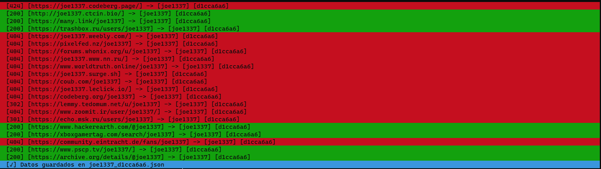

# osint-andy

A simple library for user osinting and account discovery

### Uso
#### 1) Clonar repositorio
```
git clone https://github.com/CarsonSpiffman/osint-andy
```
#### 2) En el mismo directorio crear un archivo Python

#### 3) Ejemplos
###### Uso basico
```python
from osintAndy import osintRecon

recon = osintRecon("jhon_doe1")
recon.osint()
```
###### Se van a buscar en 350 sitios webs el usuario proporcionado, luego se guarda todo en un json generado con la informacion
```json
{"_default": {"1": {"usuario": "jhon", "sitio": "https://www.chess.com/member/jhon", "status": 200, "UID": "95d1b686"}, "2": {"usuario": "jhon", "sitio": "https://binarysearch.com/@/jhon", "status": 200, "UID": "95d1b686"}, "3": {"usuario": "jhon", "sitio": "https://about.me/jhon", "status": 200, "UID": "95d1b686"}, "4": {"usuario": "jhon", "sitio": "https://www.capfriendly.com/users/jhon", "status": 200, "UID": "95d1b686"}, "5": {"usuario": "jhon", "sitio": "https://www.behance.net/jhon", "status": 200, "UID": "95d1b686"}, "6": {"usuario": "jhon", "sitio": "https://www.codewars.com/users/jhon", "status": 200, "UID": "95d1b686"}, "7": {"usuario": "jhon", "sitio": "https://gitlab.com/jhon", "status": 200, "UID": "95d1b686"}, "8": {"usuario": "jhon", "sitio": "https://dev.to/jhon", "status": 200, "UID": "95d1b686"}, "9": {"usuario": "jhon", "sitio": "https://hackerone.com/jhon", "status": 200, "UID": "95d1b686"}, "10": {"usuario": "jhon", "sitio": "http://en.gravatar.com/jhon", "status": 200, "UID": "95d1b686"}, "11": {"usuario": "jhon", "sitio": "https://fortnitetracker.com/profile/all/jhon", "status": 200, "UID": "95d1b686"}, "12": {"usuario": "jhon", "sitio": "https://audiojungle.net/user/jhon", "status": 200, "UID": "95d1b686"}, "13": {"usuario": "jhon", "sitio": "https://www.designspiration.com/jhon/", "status": 200, "UID": "95d1b686"}, "14": {"usuario": "jhon", "sitio": "https://jhon.carbonmade.com/", "status": 200, "UID": "95d1b686"}, "15": {"usuario": "jhon", "sitio": "https://f3.cool/jhon/", "status": 200, "UID": "95d1b686"}, "16": {"usuario": "jhon", "sitio": "https://www.mixcloud.com/jhon/", "status": 200, "UID": "95d1b686"}, "17": {"usuario": "jhon", "sitio": "https://www.codecademy.com/profiles/jhon", "status": 200, "UID": "95d1b686"}, "18": {"usuario": "jhon", "sitio": "https://discuss.elastic.co/u/jhon", "status": 200, "UID": "95d1b686"}, "19": {"usuario": "jhon", "sitio": "https://www.coroflot.com/jhon", "status": 200, "UID": "95d1b686"}, "20": {"usuario": "jhon", "sitio": "https://kik.me/jhon", "status": 200, "UID": "95d1b686"}, "21": {"usuario": "jhon", "sitio": "https://hub.docker.com/u/jhon/", "status": 200, "UID": "95d1b686"}, "22": {"usuario": "jhon", "sitio": "https://www.flickr.com/people/jhon", "status": 200, "UID": "95d1b686"}, "23": {"usuario": "jhon", "sitio": "https://ello.co/jhon", "status": 200, "UID": "95d1b686"}, "24": {"usuario": "jhon", "sitio": "https://bitbucket.org/jhon/", "status": 200, "UID": "95d1b686"}, "25": {"usuario": "jhon", "sitio": "https://flare.rive.app/a/jhon/", "status": 200, "UID": "95d1b686"}, "26": {"usuario": "jhon", "sitio": "https://jhon.blogspot.com/", "status": 200, "UID": "95d1b686"}, "27": {"usuario": "jhon", "sitio": "https://asciinema.org/~jhon", "status": 200, "UID": "95d1b686"}, "28": {"usuario": "jhon", "sitio": "https://dribbble.com/jhon/about", "status": 200, "UID": "95d1b686"}, "29": {"usuario": "jhon", "sitio": "https://pastebin.com/u/jhon", "status": 200, "UID": "95d1b686"}, "30": {"usuario": "jhon", "sitio": "https://old.reddit.com/user/jhon", "status": 200, "UID": "95d1b686"}, "31": {"usuario": "jhon", "sitio": "https://jhon.slack.com", "status": 200, "UID": "95d1b686"}, "32": {"usuario": "jhon", "sitio": "https://bandcamp.com/jhon", "status": 200, "UID": "95d1b686"}, "33": {"usuario": "jhon", "sitio": "https://career.habr.com/jhon", "status": 200, "UID": "95d1b686"}, "34": {"usuario": "jhon", "sitio": "https://ask.fm/jhon", "status": 200, "UID": "95d1b686"}, "35": {"usuario": "jhon", "sitio": "https://www.cnet.com/profiles/jhon/", "status": 200, "UID": "95d1b686"}, "36": {"usuario": "jhon", "sitio": "https://gurushots.com/jhon/photos", "status": 200, "UID": "95d1b686"}, "37": {"usuario": "jhon", "sitio": "https://hubski.com/user/jhon", "status": 200, "UID": "95d1b686"}, "38": {"usuario": "jhon", "sitio": "https://www.buymeacoffee.com/jhon", "status": 200, "UID": "95d1b686"}, "39": {"usuario": "jhon", "sitio": "https://blog.naver.com/jhon", "status": 200, "UID": "95d1b686"}, "40": {"usuario": "jhon", "sitio": "https://pokemonshowdown.com/users/jhon", "status": 200, "UID": "95d1b686"}, "41": {"usuario": "jhon", "sitio": "https://beta.cent.co/jhon/", "status": 200, "UID": "95d1b686"}, "42": {"usuario": "jhon", "sitio": "https://issuu.com/jhon", "status": 200, "UID": "95d1b686"}, "43": {"usuario": "jhon", "sitio": "https://www.bookcrossing.com/mybookshelf/jhon/", "status": 200, "UID": "95d1b686"}, "44": {"usuario": "jhon", "sitio": "https://ch.tetr.io/u/jhon", "status": 200, "UID": "95d1b686"}, "45": {"usuario": "jhon", "sitio": "https://lichess.org/@/jhon", "status": 200, "UID": "95d1b686"}, "46": {"usuario": "jhon", "sitio": "https://steamcommunity.com/groups/jhon", "status": 200, "UID": "95d1b686"}, "47": {"usuario": "jhon", "sitio": "https://vimeo.com/jhon", "status": 200, "UID": "95d1b686"}, "48": {"usuario": "jhon", "sitio": "https://unsplash.com/@jhon", "status": 200, "UID": "95d1b686"}, "49": {"usuario": "jhon", "sitio": "https://open.spotify.com/user/jhon", "status": 200, "UID": "95d1b686"}, "50": {"usuario": "jhon", "sitio": "https://www.duolingo.com/profile/jhon", "status": 200, "UID": "95d1b686"}, "51": {"usuario": "jhon", "sitio": "https://www.discogs.com/user/jhon", "status": 200, "UID": "95d1b686"}, "52": {"usuario": "jhon", "sitio": "https://github.com/jhon", "status": 200, "UID": "95d1b686"}, "53": {"usuario": "jhon", "sitio": "https://m.twitch.tv/jhon", "status": 200, "UID": "95d1b686"}, "54": {"usuario": "jhon", "sitio": "https://www.freelancer.com/u/jhon", "status": 200, "UID": "95d1b686"}, "55": {"usuario": "jhon", "sitio": "https://medium.com/@jhon", "status": 200, "UID": "95d1b686"}, "56": {"usuario": "jhon", "sitio": "https://www.deviantart.com/jhon", "status": 200, "UID": "95d1b686"}, "57": {"usuario": "jhon", "sitio": "https://community.windy.com/user/jhon", "status": 200, "UID": "95d1b686"}, "58": {"usuario": "jhon", "sitio": "https://www.patreon.com/jhon", "status": 200, "UID": "95d1b686"}, "59": {"usuario": "jhon", "sitio": "https://allmylinks.com/jhon", "status": 200, "UID": "95d1b686"}, "60": {"usuario": "jhon", "sitio": "https://www.virustotal.com/gui/user/jhon", "status": 200, "UID": "95d1b686"}, "61": {"usuario": "jhon", "sitio": "https://www.tradingview.com/u/jhon/", "status": 200, "UID": "95d1b686"}, "62": {"usuario": "jhon", "sitio": "https://pcpartpicker.com/user/jhon", "status": 200, "UID": "95d1b686"}, "63": {"usuario": "jhon", "sitio": "https://tryhackme.com/p/jhon", "status": 200, "UID": "95d1b686"}, "64": {"usuario": "jhon", "sitio": "http://www.wikidot.com/user:info/jhon", "status": 200, "UID": "95d1b686"}, "65": {"usuario": "jhon", "sitio": "https://www.openstreetmap.org/user/jhon", "status": 200, "UID": "95d1b686"}, "66": {"usuario": "jhon", "sitio": "https://www.interpals.net/jhon", "status": 200, "UID": "95d1b686"}, "67": {"usuario": "jhon", "sitio": "https://www.pinkbike.com/u/jhon/", "status": 200, "UID": "95d1b686"}, "68": {"usuario": "jhon", "sitio": "https://myanimelist.net/profile/jhon", "status": 200, "UID": "95d1b686"}, "69": {"usuario": "jhon", "sitio": "https://www.eyeem.com/u/jhon", "status": 200, "UID": "95d1b686"}, "70": {"usuario": "jhon", "sitio": "https://trello.com/jhon/activity", "status": 200, "UID": "95d1b686"}, "71": {"usuario": "jhon", "sitio": "https://steamcommunity.com/id/jhon", "status": 200, "UID": "95d1b686"}, "72": {"usuario": "jhon", "sitio": "https://slashdot.org/~jhon", "status": 200, "UID": "95d1b686"}, "73": {"usuario": "jhon", "sitio": "https://www.hackster.io/jhon", "status": 200, "UID": "95d1b686"}, "74": {"usuario": "jhon", "sitio": "https://jhon.newgrounds.com", "status": 200, "UID": "95d1b686"}, "75": {"usuario": "jhon", "sitio": "https://jhon.booth.pm/", "status": 200, "UID": "95d1b686"}, "76": {"usuario": "jhon", "sitio": "https://vero.co/jhon", "status": 200, "UID": "95d1b686"}, "77": {"usuario": "jhon", "sitio": "https://www.myminifactory.com/users/jhon", "status": 200, "UID": "95d1b686"}, "78": {"usuario": "jhon", "sitio": "https://rubygems.org/profiles/jhon", "status": 200, "UID": "95d1b686"}, "79": {"usuario": "jhon", "sitio": "https://forum.sublimetext.com/u/jhon", "status": 200, "UID": "95d1b686"}, "80": {"usuario": "jhon", "sitio": "https://www.producthunt.com/@jhon", "status": 200, "UID": "95d1b686"}, "81": {"usuario": "jhon", "sitio": "https://lolchess.gg/profile/na/jhon", "status": 200, "UID": "95d1b686"}, "82": {"usuario": "jhon", "sitio": "https://www.7cups.com/@jhon", "status": 200, "UID": "95d1b686"}, "83": {"usuario": "jhon", "sitio": "https://keybase.io/jhon", "status": 200, "UID": "95d1b686"}, "84": {"usuario": "jhon", "sitio": "https://profiles.wordpress.org/jhon/", "status": 200, "UID": "95d1b686"}, "85": {"usuario": "jhon", "sitio": "https://robertsspaceindustries.com/citizens/jhon", "status": 200, "UID": "95d1b686"}, "86": {"usuario": "jhon", "sitio": "https://www.nairaland.com/jhon", "status": 200, "UID": "95d1b686"}, "87": {"usuario": "jhon", "sitio": "https://www.house-mixes.com/profile/jhon", "status": 200, "UID": "95d1b686"}, "88": {"usuario": "jhon", "sitio": "https://www.couchsurfing.com/people/jhon", "status": 200, "UID": "95d1b686"}, "89": {"usuario": "jhon", "sitio": "https://launchpad.net/~jhon", "status": 200, "UID": "95d1b686"}, "90": {"usuario": "jhon", "sitio": "https://weheartit.com/jhon", "status": 200, "UID": "95d1b686"}, "91": {"usuario": "jhon", "sitio": "https://www.championat.com/user/jhon/", "status": 200, "UID": "95d1b686"}, "92": {"usuario": "jhon", "sitio": "https://soundcloud.com/jhon", "status": 200, "UID": "95d1b686"}, "93": {"usuario": "jhon", "sitio": "https://www.younow.com/jhon", "status": 200, "UID": "95d1b686"}, "94": {"usuario": "jhon", "sitio": "https://devrant.com/users/jhon", "status": 200, "UID": "95d1b686"}, "95": {"usuario": "jhon", "sitio": "https://www.warriorforum.com/members/jhon.html", "status": 200, "UID": "95d1b686"}, "96": {"usuario": "jhon", "sitio": "https://data.typeracer.com/pit/profile?user=jhon", "status": 200, "UID": "95d1b686"}, "97": {"usuario": "jhon", "sitio": "https://www.instagram.com/jhon/", "status": 200, "UID": "95d1b686"}, "98": {"usuario": "jhon", "sitio": "https://www.reverbnation.com/jhon", "status": 200, "UID": "95d1b686"}, "99": {"usuario": "jhon", "sitio": "https://aminoapps.com/u/jhon", "status": 200, "UID": "95d1b686"}, "100": {"usuario": "jhon", "sitio": "https://youpic.com/photographer/jhon/", "status": 200, "UID": "95d1b686"}, "101": {"usuario": "jhon", "sitio": "https://my.flightradar24.com/jhon", "status": 200, "UID": "95d1b686"}, "102": {"usuario": "jhon", "sitio": "https://soylentnews.org/~jhon", "status": 200, "UID": "95d1b686"}, "103": {"usuario": "jhon", "sitio": "https://imgsrc.ru/main/user.php?user=jhon", "status": 200, "UID": "95d1b686"}, "104": {"usuario": "jhon", "sitio": "https://www.zhihu.com/people/jhon", "status": 200, "UID": "95d1b686"}, "105": {"usuario": "jhon", "sitio": "https://www.gamespot.com/profile/jhon/", "status": 200, "UID": "95d1b686"}, "106": {"usuario": "jhon", "sitio": "https://hackaday.io/jhon", "status": 200, "UID": "95d1b686"}, "107": {"usuario": "jhon", "sitio": "https://akniga.org/profile/jhon", "status": 200, "UID": "95d1b686"}, "108": {"usuario": "jhon", "sitio": "https://www.geocaching.com/p/default.aspx?u=jhon", "status": 200, "UID": "95d1b686"}, "109": {"usuario": "jhon", "sitio": "https://hashnode.com/@jhon", "status": 200, "UID": "95d1b686"}, "110": {"usuario": "jhon", "sitio": "https://gist.github.com/jhon/", "status": 200, "UID": "95d1b686"}, "111": {"usuario": "jhon", "sitio": "https://bitcoinforum.com/profile/jhon", "status": 200, "UID": "95d1b686"}, "112": {"usuario": "jhon", "sitio": "https://www.smule.com/jhon", "status": 200, "UID": "95d1b686"}, "113": {"usuario": "jhon", "sitio": "https://trashbox.ru/users/jhon", "status": 200, "UID": "95d1b686"}, "114": {"usuario": "jhon", "sitio": "https://www.drive2.ru/users/jhon", "status": 200, "UID": "95d1b686"}, "115": {"usuario": "jhon", "sitio": "https://myspace.com/jhon", "status": 200, "UID": "95d1b686"}, "116": {"usuario": "jhon", "sitio": "https://forum.guns.ru/forummisc/blog/jhon", "status": 200, "UID": "95d1b686"}, "117": {"usuario": "jhon", "sitio": "https://linktr.ee/jhon", "status": 200, "UID": "95d1b686"}, "118": {"usuario": "jhon", "sitio": "https://archiveofourown.org/users/jhon", "status": 200, "UID": "95d1b686"}, "119": {"usuario": "jhon", "sitio": "https://jhon.rajce.idnes.cz/", "status": 200, "UID": "95d1b686"}, "120": {"usuario": "jhon", "sitio": "http://forum.igromania.ru/member.php?username=jhon", "status": 200, "UID": "95d1b686"}, "121": {"usuario": "jhon", "sitio": "https://mastodon.social/@jhon", "status": 200, "UID": "95d1b686"}, "122": {"usuario": "jhon", "sitio": "https://mastodon.cloud/@jhon", "status": 200, "UID": "95d1b686"}, "123": {"usuario": "jhon", "sitio": "https://virgool.io/@jhon", "status": 200, "UID": "95d1b686"}, "124": {"usuario": "jhon", "sitio": "https://forums.majorgeeks.com/search/search?users=jhon", "status": 200, "UID": "95d1b686"}, "125": {"usuario": "jhon", "sitio": "https://jhon.livejournal.com", "status": 200, "UID": "95d1b686"}, "126": {"usuario": "jhon", "sitio": "https://musicbrainz.org/user/jhon", "status": 200, "UID": "95d1b686"}, "127": {"usuario": "jhon", "sitio": "https://pr0gramm.com/user/jhon", "status": 200, "UID": "95d1b686"}, "128": {"usuario": "jhon", "sitio": "https://jhon.carrd.co/", "status": 200, "UID": "95d1b686"}, "129": {"usuario": "jhon", "sitio": "https://jbzd.com.pl/uzytkownik/jhon", "status": 200, "UID": "95d1b686"}, "130": {"usuario": "jhon", "sitio": "https://www.forumhouse.ru/members/?username=jhon", "status": 200, "UID": "95d1b686"}, "131": {"usuario": "jhon", "sitio": "https://kwork.ru/user/jhon", "status": 200, "UID": "95d1b686"}, "132": {"usuario": "jhon", "sitio": "https://www.npmjs.com/~jhon", "status": 200, "UID": "95d1b686"}, "133": {"usuario": "jhon", "sitio": "https://jhon.imgbb.com/", "status": 200, "UID": "95d1b686"}, "134": {"usuario": "jhon", "sitio": "https://social.tchncs.de/@jhon", "status": 200, "UID": "95d1b686"}, "135": {"usuario": "jhon", "sitio": "https://www.baby.ru/u/jhon/", "status": 200, "UID": "95d1b686"}, "136": {"usuario": "jhon", "sitio": "https://tenor.com/users/jhon", "status": 200, "UID": "95d1b686"}, "137": {"usuario": "jhon", "sitio": "https://blip.fm/jhon", "status": 200, "UID": "95d1b686"}, "138": {"usuario": "jhon", "sitio": "https://bodyspace.bodybuilding.com/jhon/", "status": 200, "UID": "95d1b686"}, "139": {"usuario": "jhon", "sitio": "https://www.flowcode.com/page/jhon", "status": 200, "UID": "95d1b686"}, "140": {"usuario": "jhon", "sitio": "https://forum.velomania.ru/member.php?username=jhon", "status": 200, "UID": "95d1b686"}, "141": {"usuario": "jhon", "sitio": "https://jhon.contactin.bio/", "status": 200, "UID": "95d1b686"}, "142": {"usuario": "jhon", "sitio": "https://codeberg.org/jhon", "status": 200, "UID": "95d1b686"}, "143": {"usuario": "jhon", "sitio": "https://linkkle.com/jhon", "status": 200, "UID": "95d1b686"}, "144": {"usuario": "jhon", "sitio": "https://boardgamegeek.com/user/jhon", "status": 200, "UID": "95d1b686"}, "145": {"usuario": "jhon", "sitio": "https://www.bitchute.com/channel/jhon/", "status": 200, "UID": "95d1b686"}, "146": {"usuario": "jhon", "sitio": "https://php.ru/forum/members/?username=jhon", "status": 200, "UID": "95d1b686"}, "147": {"usuario": "jhon", "sitio": "https://www.sports.ru/profile/jhon/", "status": 200, "UID": "95d1b686"}, "148": {"usuario": "jhon", "sitio": "http://jhon.contactinbio.com/", "status": 200, "UID": "95d1b686"}, "149": {"usuario": "jhon", "sitio": "https://note.com/jhon", "status": 200, "UID": "95d1b686"}, "150": {"usuario": "jhon", "sitio": "https://www.change.org/o/jhon", "status": 200, "UID": "95d1b686"}, "151": {"usuario": "jhon", "sitio": "https://jhon.neocities.org/", "status": 200, "UID": "95d1b686"}, "152": {"usuario": "jhon", "sitio": "https://www.opennet.ru/~jhon", "status": 200, "UID": "95d1b686"}, "153": {"usuario": "jhon", "sitio": "https://codeforces.com/profile/jhon", "status": 200, "UID": "95d1b686"}, "154": {"usuario": "jhon", "sitio": "https://dlive.tv/jhon", "status": 200, "UID": "95d1b686"}, "155": {"usuario": "jhon", "sitio": "http://jhon.ctcin.bio/", "status": 200, "UID": "95d1b686"}, "156": {"usuario": "jhon", "sitio": "https://www.hackerearth.com/@jhon", "status": 200, "UID": "95d1b686"}, "157": {"usuario": "jhon", "sitio": "https://www.dailykos.com/user/jhon", "status": 200, "UID": "95d1b686"}, "158": {"usuario": "jhon", "sitio": "https://many.link/jhon", "status": 200, "UID": "95d1b686"}, "159": {"usuario": "jhon", "sitio": "https://jhon.www.nn.ru/", "status": 200, "UID": "95d1b686"}, "160": {"usuario": "jhon", "sitio": "https://lnk.bio/jhon", "status": 200, "UID": "95d1b686"}, "161": {"usuario": "jhon", "sitio": "https://www.hunting.ru/forum/members/?username=jhon", "status": 200, "UID": "95d1b686"}, "162": {"usuario": "jhon", "sitio": "https://archive.org/details/@jhon", "status": 200, "UID": "95d1b686"}, "163": {"usuario": "jhon", "sitio": "https://xboxgamertag.com/search/jhon", "status": 200, "UID": "95d1b686"}, "164": {"usuario": "jhon", "sitio": "https://community.eintracht.de/fans/jhon", "status": 200, "UID": "95d1b686"}, "165": {"usuario": "jhon", "sitio": "https://jhon.surge.sh", "status": 200, "UID": "95d1b686"}, "166": {"usuario": "jhon", "sitio": "https://www.zoomit.ir/user/jhon/", "status": 200, "UID": "95d1b686"}, "167": {"usuario": "jhon", "sitio": "https://www.pscp.tv/jhon/", "status": 200, "UID": "95d1b686"}, "168": {"usuario": "jhon", "sitio": "https://notabug.org/jhon", "status": 200, "UID": "95d1b686"}, "169": {"usuario": "jhon", "sitio": "http://www.authorstream.com/jhon/", "status": 200, "UID": "95d1b686"}, "170": {"usuario": "jhon", "sitio": "https://irecommend.ru/users/jhon", "status": 200, "UID": "95d1b686"}}}
```

###### Otro ejemplo
```python
from osintAndy import osintRecon

usuarios = ["jhon", "doe", "dex2", "rich"]

for x in usuarios:
    recon = osintRecon(usuarios)
    recon.osint()
```


###### Hay varios falso positivos, se puede personalizar el json con las paginas webs, luego lo voy a estar actualizando agregandole mas funciones



###### Cualquier duda o consulta preguntame a mi discord personal: `Carson#9752`
